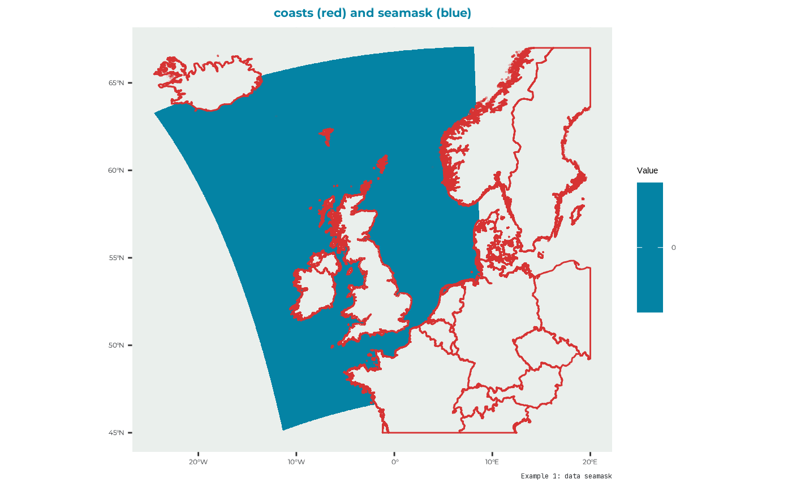
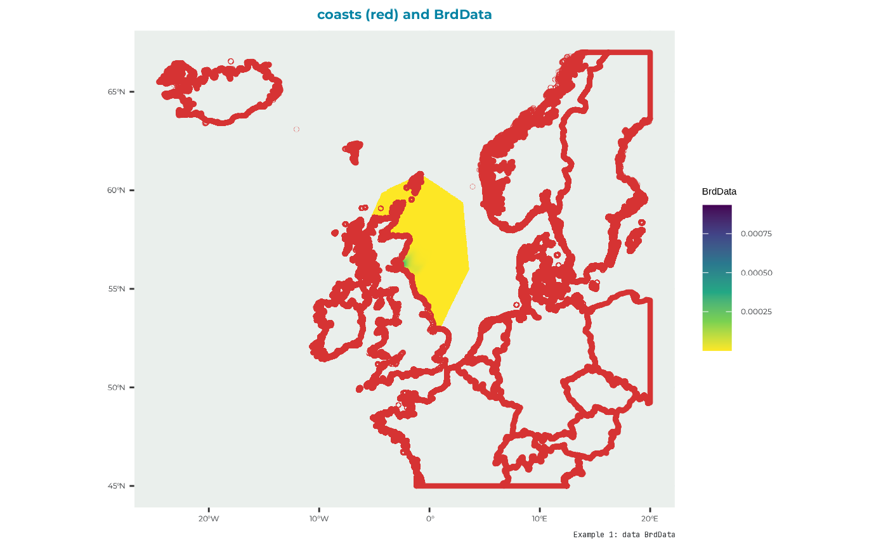
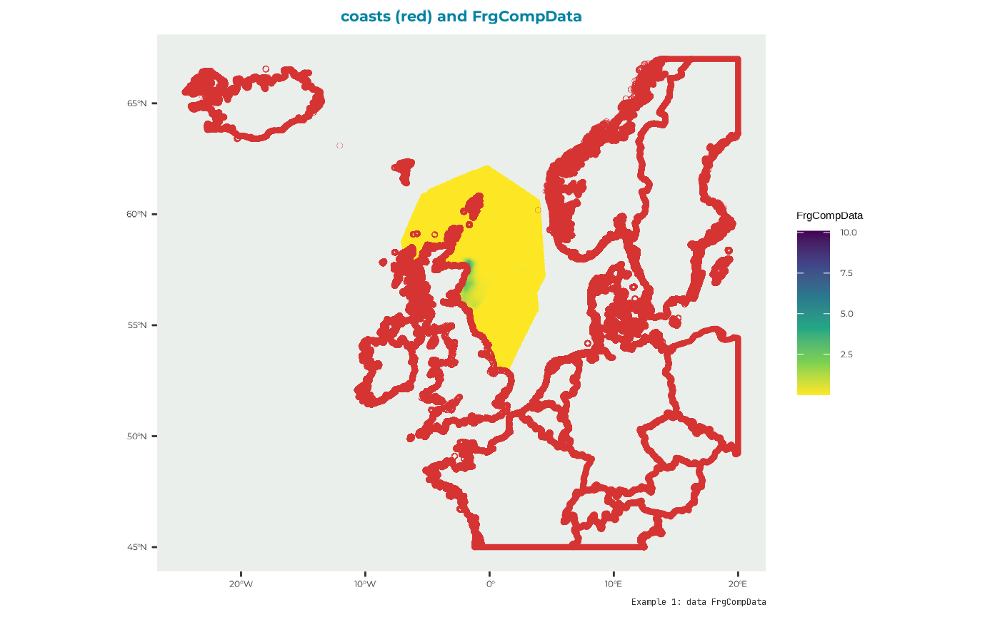
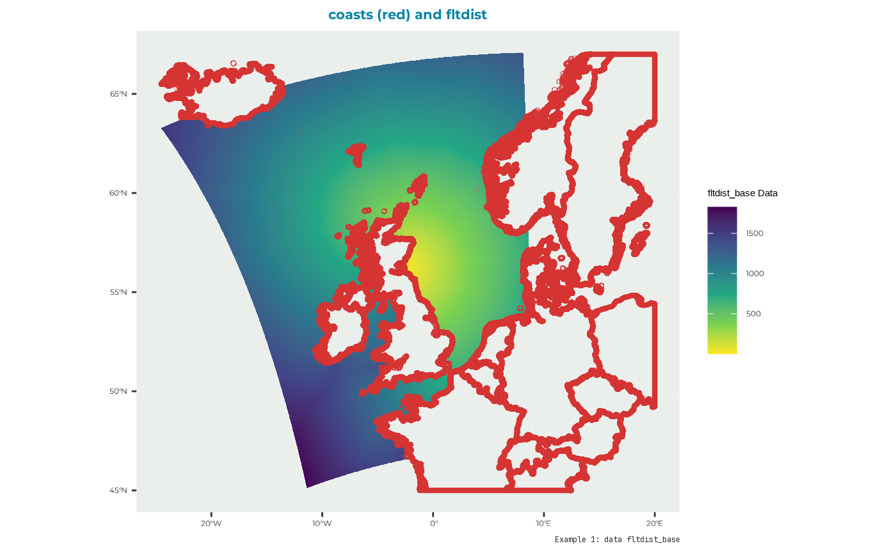
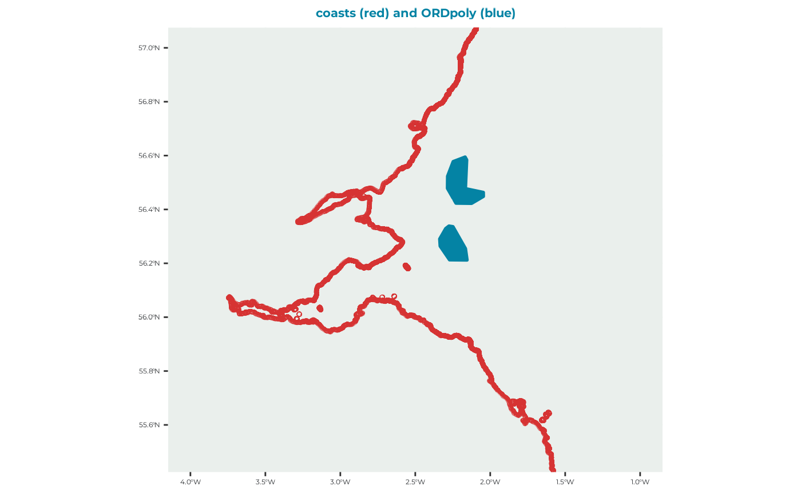

# Example kittiwake: step 1 - seabORD inputs

Load the seabORD package

``` r

library(seabORD)
```

``` r


### UK outline

#uk_map <- dplyr::select(
  #rnaturalearth::ne_countries(country = "United Kingdom",
                              #scale = "medium",
                              #returnclass = "sf"),
  #name,
  #geometry)

#use coastline
uk_map <- seabORD::cef_coast_4326


### theme definition
sysfonts::font_add_google("Montserrat", "montserrat")  # Base and heading font
sysfonts::font_add_google("JetBrains Mono", "jetbrains_mono")  # Code font
showtext::showtext_auto()

theme_bslib <- ggplot2::theme(
  plot.background = ggplot2::element_rect(fill = "#fff", color = NA),       # Background color
  panel.background = ggplot2::element_rect(fill = "#EAEFEC", color = NA),  # Panel background (secondary)
  panel.grid.major = ggplot2::element_line(color = "#EAEFEC"),             # Major grid lines
  panel.grid.minor = ggplot2::element_line(color = "#EAEFEC"),             # Minor grid lines
  axis.text = ggplot2::element_text(color = "#292C2F", family = "montserrat"),  # Axis text (foreground and font)
  axis.title = ggplot2::element_text(color = "#292C2F", family = "montserrat"), # Axis titles
  plot.title = ggplot2::element_text(color = "#0483A4", family = "montserrat", size = 16, face = "bold", hjust = 0.5), # Title
  legend.background = ggplot2::element_rect(fill = "#fff", color = NA),    # Legend background
  legend.key = ggplot2::element_rect(fill = "#EAEFEC", color = NA),        # Legend key
  legend.text = ggplot2::element_text(color = "#292C2F", family = "montserrat"), # Legend text
  plot.caption = ggplot2::element_text(color = "#292C2F", family = "jetbrains_mono"),
  axis.title.x = ggplot2::element_blank(),  # Remove x-axis label
  axis.title.y = ggplot2::element_blank(),# Caption for code font
)
```

## Preparing the inputs

To run seabORD several inputs are needed:

| arguments | type | description |
|----|----|----|
| Par | List | The main parameters controlling/defining this run e.g., species and colony |
| modPar | List | Parameters relating to the model mode and computer environment |
| ordPar | List | Input parameters relating to the ORDs |
| switches | List | A set of switches/flags used to control optional features of the run and determine range of outptus |
| seamask | Raster | land/sea grid, 1km expected. |
| spadat1 | Tibble | Information relating to the colony/SPA |
| spadat2 | Tibble | Information relating to the colony/SPA |
| spdat | Dataframe | Species-specific parameters |
| BrdData | Raster | Bird distribution map - derived from GPS data or failing that, a distance-decay model |
| FrgCompData | Raster | Competition distribution map - derived from GPS data or failing that, a distance-decay model |
| fltdist_base | Raster | Flight distance by sea, without ORDs. See user guide for details. |
| FlightGridcorrection | Raster | Flight distance transition layer (gdistance) corrected for distortions relating to the CRS |
| ORDpoly | Multipolygon (simple features) | The ORD footprints |

The package comes with some example input data to run the model with.
Here’s an example run of the model with detailed explanation for each
input argument.

### Par

List for biological parameters:

- **thisSpecies**: The species being used. You can select from “KI”
  (kittiwake), “GU” (guillemot), “RA” (razorbill), or “PU” (puffin)

- **colonies**: The code number for the colony/SPA being modelled

- **Nscalefactor**: What proportion of the total population do you want
  to run the model for i.e., Nscalefactor = 1 is for 100% of the
  population, where 0.1 would represent 10% of the population which may
  be useful for test runs.

- **Prob_Displacement**: The proportion of individual birds which will
  experience displacement effects *if* interacting with an ORD during a
  certain trip. E.g., if Prob_Displacement = 0.6, 60% of individuals
  will be displacement susceptible.

- **Prob_Barrier**: The proportion of individuals which experience
  displacement effects, which will also experience barrier effects.
  E.g., if Prob_Barrier = 1, 100% of individuals which are displacement
  susceptible will also be barrier effect susceptible (i.e., 60% of
  total population)

- **PreyType**: This dictates the type of prey layer used in the
  simulation, which is typically set to “uniform”, meaning all prey
  cells begin with the same prey value.

- **collision**: Not currently used

- **SiteSelectionMethod**: Set to “Map” currently, but options to add in
  a distance decay module.

- **MaxDistancekm**: Not currently used in this version

- **PropInRange**: Not currently used in this version

- **Npairspercol**: The number of pairs of adult birds at the given
  colony/SPA

- **Pmedian**: The value of prey in cells in this particular replicate.
  Prior to running the simulation with ORDs this must be determined in a
  calibration step.

``` r

Par_example <-  seabORD::example_1_lists$Par

str(Par_example)
#> List of 12
#>  $ thisSpecies        : chr "KI"
#>  $ colonies           : chr "UK9004171"
#>  $ Nscalefactor       : num 1
#>  $ Prob_Displacement  : num 0.6
#>  $ Prob_Barrier       : num 1
#>  $ PreyType           : chr "Uniform"
#>  $ collision          : chr "Off"
#>  $ SiteSelectionMethod: chr "Map"
#>  $ MaxDistancekm      : num 0
#>  $ PropInRange        : num 0
#>  $ Npairspercol       : num 2898
#>  $ Pmedian            : num 158
```

### modPar

List for model parameters.

- **Nparallel**: This is used for parallel runs only (i.e., set to “NA”
  for runs on local machine) to indicate which replicate is being run
  which will dictate the seed being so that reproducibility is conducted
  in the same fashion as for local runs.

- **initialseed**: A seed for reproducibility.

- **reference**: A name to be attached to folders and files emanating
  from this particular simulation which will be generated from other
  outputs in the order of: model environment; model mode
  (calibration/scenario); species, colony ID. E.g.,
  “serial_scenario_KI_UK9004171”

- **outputdir**: The file directory where outputs from your model will
  be saved to.

- **Nreplicates**: The number of replicates being used

make a folder in the directory to store your output (you can place it
wherever)

``` r

# Create the ouput folder "output_seabORD" if not existing already
if (!dir.exists("output_seabORD")) {
  dir.create("output_seabORD")
}
```

and then the list of modPar

``` r

modPar_example <- seabORD::example_1_lists$modPar

str(modPar_example)
#> List of 5
#>  $ Nparallel  : logi NA
#>  $ initialseed: num 6598
#>  $ reference  : chr "serial_scenario_KI_UK9004171"
#>  $ outputdir  : chr "output_seabORD"
#>  $ Nreplicates: num 1
```

### ordPar

List for wind farm parameters

- **include_ORDs**: Code names of ORDs to be included in this run, e.g.,
  “NEART” is Neart na Gaoithe

- **parnames**: Further naming of wind farms to be included

- **FootprintBorder**: The extension distance (km) of the buffer around
  the ORD which birds avoid

- **BufferZone**: Also known as the displacement zone, this is the
  distance (km) extending beyond the FootprintBorder where displacement
  susceptible birds will be displaced to.

``` r

ordPar_example <-  seabORD::example_1_lists$ordPar

str(ordPar_example)
#> List of 4
#>  $ include_ORDs   : chr [1:2] "NEART" "INCAP"
#>  $ parnames       : chr "NEART;INCAP"
#>  $ FootprintBorder: num 2
#>  $ BufferZone     : num 5
```

### Switches

This parameter requires a llist() object that defines the optional
features of the run. It accepts the following options:

- **environment** : “serial” or “parallel”

- **modelmode**: “scenario” or “calibration”

- **debugmode**: 0, 1, or 2 - typically used during development so can
  be ignored

- **bycol**: TRUE or FALSE

- **bysus**: TRUE or FALSE

- **bych**: TRUE or FALSE

- **printdaily**: TRUE or FALSE - an option to print out daily outputs
  from each timestep for all modelled indiviudals

- **printseason**: TRUE or FALSE - more detailed outputs from each
  season (baseline/scenario), as opposed to teh higher level summary
  issued as standard.

- **printpair**: TRUE or FALSE - more detailed outputs from each pair.

- **minout**: TRUE or FALSE - *to be completed*

- **silent**: TRUE or FALSE - *to be completed*

- **saverds**: TRUE or FALSE - This should nearly always be set to TRUE,
  as this is the standard output summary.

- **savebirdflightmap**: TRUE or FALSE - an option to view a map of
  foraging locations from this simulation, which can be used as a visual
  check that the simulations are executing as intended i.e., have you
  run a simulation with the correct colony and wind farm set up.

There is an example list available in the package that can be accessed
by simply call in the built-in list “example_switch_list”:

``` r


#get the example switches list
switches_example <- seabORD::example_1_lists$switches

#check the setting of this example
str(switches_example)
#> List of 14
#>  $ environment      : chr "serial"
#>  $ modelmode        : chr "scenario"
#>  $ debugmode        : num 0
#>  $ bycol            : logi FALSE
#>  $ bysus            : logi FALSE
#>  $ bych             : logi FALSE
#>  $ printdaily       : logi FALSE
#>  $ printseason      : logi FALSE
#>  $ printpair        : logi FALSE
#>  $ printfinal       : logi FALSE
#>  $ minout           : logi FALSE
#>  $ silent           : logi FALSE
#>  $ saverds          : logi FALSE
#>  $ savebirdflightmap: logi FALSE
```

In this example seabORD will in serial and in scenario mode; without
debugging and by saving the output as a .rds file.

### seamask

Used to indicate where the sea is. Example data to be used as seamask
can be found built in the package as “seamask_3035_example” to make the
raster for the seamask:

``` r

example_data_seamask <- seabORD::seamask_3035_example
str(example_data_seamask)
#> List of 2
#>  $ matrix  : num [1:3469400, 1] 0 0 0 0 0 0 0 0 0 0 ...
#>   ..- attr(*, "dimnames")=List of 2
#>   .. ..$ : NULL
#>   .. ..$ : chr "seamask_3035"
#>  $ metadata:List of 7
#>   ..$ n_rows: num 2200
#>   ..$ n_cols: num 1577
#>   ..$ x_min : num 2661966
#>   ..$ x_max : num 4238966
#>   ..$ y_min : num 2685159
#>   ..$ y_max : num 4885159
#>   ..$ crs   : chr "PROJCRS[\"unknown\",\n    BASEGEOGCRS[\"unknown\",\n        DATUM[\"Unknown based on GRS80 ellipsoid\",\n      "| __truncated__
```

We can use this data to make the raster using the **raster** package

``` r


#make a raster with the right dimension/proj/extents etc.
seamask_example <- 
  raster::raster(
    nrows = example_data_seamask$metadata[["n_rows"]],
    ncols = example_data_seamask$metadata[["n_cols"]],
    xmn = example_data_seamask$metadata[["x_min"]],
    xmx = example_data_seamask$metadata[["x_max"]],
    ymn = example_data_seamask$metadata[["y_min"]],
    ymx = example_data_seamask$metadata[["y_max"]],
    crs = example_data_seamask$metadata[["crs"]]
)

#fill it with the data available
seamask_example <- raster::setValues(seamask_example, #the raster
                                     example_data_seamask$matrix) #the values
#Set the name of the layer
names(seamask_example) <- "seamask_3035"
```

which looks like:

    #> Warning in ggplot2::guide_colorbar(na.translate = TRUE, title = "Value"): Arguments in `...` must be used.
    #> ✖ Problematic argument:
    #> • na.translate = TRUE
    #> ℹ Did you misspell an argument name?



### spadat1

For this example the values for spadat1 for the site “UK9004171” are
taken from the built-in dataset “spacoordinates” which has data for all
the sites relevant for the CEF. Get only what’s relevant for this
example.

``` r

#open the dataset provided with the pacakge
spadat1_example <- 
  tibble::as_tibble( #as a tibble
      dplyr::filter(seabORD::spacoordinates, #the full dataset
                    SITECODE == "UK9004171") #the iste of interest
  )

print(t(spadat1_example)) #display the data for the example site
#>              [,1]       
#> SITECODE     "UK9004171"
#> CEF.include  "TRUE"     
#> Marine       "FALSE"    
#> Longitude    "-2.564"   
#> Latitude     "56.186"   
#> dat.CELLNO   "1658699"  
#> dat.ATSEA    "TRUE"     
#> flt.LONG     "-2.558333"
#> flt.LAT      "56.18875" 
#> flt.CELLNO   "1658699"  
#> flt.ATSEA    "TRUE"     
#> flt.DIST     "0.4661833"
#> flt.near     "TRUE"     
#> datxy.E      "3544920"  
#> datxy.N      "3743923"  
#> datxy.CELLNO "1800240"  
#> datxy.ATSEA  "TRUE"     
#> fltxy.E      "3544466"  
#> fltxy.N      "3743659"  
#> fltxy.CELLNO "1800240"  
#> fltxy.ATSEA  "TRUE"     
#> fltxy.DIST   "525.4244" 
#> fltxy.near   "TRUE"
```

### spadat2

Can be derived from “spalist”

``` r

spadat2_example <- 
  tibble::as_tibble( #as a tibble
    dplyr::filter(seabORD::spalist, #the whole list
                  SITE_CODE == "UK9004171") #the site of interest
    )

#take a look
print(t(spadat2_example))
#>                       [,1]           
#> SITE_CODE             "UK9004171"    
#> SITE_NAME             "Forth Islands"
#> CEF.include           "Y"            
#> Marine.only           NA             
#> Altnames.sufficient   NA             
#> Altnames.SPApolys     NA             
#> Altnames.SMP          NA             
#> Altnames.Productivity NA             
#> Altnames.BDMPS        NA             
#> Altnames.FR           NA
```

### spdat

The species specific data for the Black-legged Kittiwake be derived from
the built in dataset “energeticsandpreydata” that has data for all 4
species that seabORD models.

``` r

spdat_example <- 
   #tibble::as_tibble( #as a tibble
     dplyr::filter(seabORD::energeticsandpreydata,
                   Code == "KI")
    # )
    
#take a look
print(t(spdat_example))
#>                  [,1]                    
#> Code             "KI"                    
#> Species          "Black-legged Kittiwake"
#> BM_adult_mn      "372.69"                
#> BM_adult_sd      "33.62"                 
#> BM_adult_mortf   "0.6"                   
#> BM_adult_abdn    "0.8"                   
#> BM_chick_mn      "36"                    
#> BM_chick_sd      "2.2"                   
#> BM_Chick_mortf   "0.6"                   
#> daylength        "36"                    
#> seasonlength     "30"                    
#> unattend_max_hrs "18"                    
#> adult_DEE_mn     "802"                   
#> adult_DEE_sd     "196"                   
#> chick_DER        "525.7"                 
#> IR_max           "4.369"                 
#> IR_half_a        "900"                   
#> IR_half_b        "0.02"                  
#> flight_msec      "13.1"                  
#> assim_eff        "0.74"                  
#> energy_prey      "6.52"                  
#> energy_nest      "427.8"                 
#> energy_flight    "1400.7"                
#> energy_searest   "400.6"                 
#> energy_forage    "1400.7"                
#> energy_warming   "26"                    
#> chick_mass_a     "11"                    
#> adult_mass_KG    "38.5"                  
#> beta             "0.038"                 
#> basesurv_poor    "0.65"                  
#> basesurv_modr    "0.8"                   
#> basesurv_good    "0.9"                   
#> massloss_poor    "20"                    
#> massloss_modr    "10"                    
#> massloss_good    "0"                     
#> chicksurv_poor   "10"                    
#> chicksurv_modr   "50"                    
#> chicksurv_good   "100"
```

### BrdData

Bird distribution map. There is a built in example dataset for this run
which is derived from GPS data and modelled with a GAM incorporating
important factors known to drive space use in this species. This is a
raster file that must re-constructed from the data as follows (as for
seamask).

``` r

example_data_brd <- seabORD::BrdData_example
#make the raster with the right dimensions..
BrdData_example <- 
  raster::raster(
  nrows = example_data_brd$metadata[["n_rows"]],
  ncols = example_data_brd$metadata[["n_cols"]],
  xmn = example_data_brd$metadata[["x_min"]],
  xmx = example_data_brd$metadata[["x_max"]],
  ymn = example_data_brd$metadata[["y_min"]],
  ymx = example_data_brd$metadata[["y_max"]],
  crs = example_data_brd$metadata[["crs"]]
)
#fill it with the data
BrdData_example <- raster::setValues(BrdData_example,
                                     example_data_brd$matrix)
#Set the name of the layer
names(BrdData_example) <- "Forth.Islands"
```

Which has data that plot like this:

``` r

BrdData_example_repr <- 
    terra::rast(BrdData_example) %>%
  terra::project(terra::crs(uk_map))
BrdData_df <- as.data.frame(BrdData_example_repr, xy = TRUE)


ggplot2::ggplot() +
  # Plot the raster
  ggplot2:: geom_raster(data = BrdData_df, ggplot2::aes(x = x, y = y, fill = ifelse(Forth.Islands == 0, NA, Forth.Islands))) +
  # Add the reprojected UK boundary
  ggplot2::geom_sf(data = uk_map, fill = NA, color = "#D63333", size = 1.5) +
  # Customize the plot
  theme_bslib +  #palette theme
    ggplot2::scale_fill_viridis_c(
    na.value = "gray",  # Set the color for NA (i.e., for 0 values)
    name = "BrdData", direction = -1) +
  ggplot2::labs(fill = "BrdData Raster Value",
               title = "coasts (red) and BrdData",
               caption = "Example 1: data BrdData")
```



### FrgCompData

Competition distribution map i.e., the distribution of conspecifics from
surrounding colonies which may interact with the colony/SPA being
simulated. This is used throughout the model to estimate how competition
from other colonies influences intake rate at different foraging sites.

``` r

example_data_frg <- seabORD::frgcompdata_example
#make the raster with the right dimensions..
FrgCompData_example <-
  raster::raster(
  nrows = example_data_frg$metadata[["n_rows"]],
  ncols = example_data_frg$metadata[["n_cols"]],
  xmn = example_data_frg$metadata[["x_min"]],
  xmx = example_data_frg$metadata[["x_max"]],
  ymn = example_data_frg$metadata[["y_min"]],
  ymx = example_data_frg$metadata[["y_max"]],
  crs = example_data_frg$metadata[["crs"]]
)
#fill it with the data
FrgCompData_example <- raster::setValues(FrgCompData_example,
                                         example_data_frg$matrix)
#Set the name of the layer
names(FrgCompData_example) <- "Forth.Islands"
```

which looks like:



### fltdist_base

Flight distance by sea, without ORDs. See user guide for details.

``` r

UK9004171_bysea <- seabORD::UK9004171_bysea_3035
#make the raster with the right dimensions..
fltdist_base_example <-
  raster::raster(
  nrows = UK9004171_bysea$metadata[["n_rows"]],
  ncols = UK9004171_bysea$metadata[["n_cols"]],
  xmn = UK9004171_bysea$metadata[["x_min"]],
  xmx = UK9004171_bysea$metadata[["x_max"]],
  ymn = UK9004171_bysea$metadata[["y_min"]],
  ymx = UK9004171_bysea$metadata[["y_max"]],
  crs = UK9004171_bysea$metadata[["crs"]]
)
#fill it with the data
fltdist_base_example <- raster::setValues(fltdist_base_example,
                                          UK9004171_bysea$matrix)
#as a raster brick. #WHY? only one layer
fltdist_base_example <- raster::brick(fltdist_base_example)
#Set the name of the layer
names(fltdist_base_example) <- "UK9004171"
```

which looks like:



### FlightGridcorrection

It’s a TransitionLayer class object. One example provided that can be
loaded

``` r

FlightGridcorrection <- seabORD::FlightGridcorrection_3035
```

### ORDpoly

This is a set of polygons used to represent the ORDs that we are
intending to predict the impact of.

``` r

ORDpoly_example <- seabORD::ORDpoly_example
```

which is a dataset with this multipolygon shapes:


